# Project 1 - Department of Veterans Affairs Analysis
San Diego is known as a military town. It is home to large bases across the Navy, Marines and Coast Guard. Many of San Diego's residents have served within the United States Military. In this project we will be exploring budget data from the Department of Veterans Affairs (VA) to determine where money is being spent and how San Diego County compares to the rest of the country in veteran population and budget expenditure from 2010 to 2015. We will also be diving into the Disability Compensation program to uncover trends in the number of veterans receiving disability and their relationship to budget expenditure.

## Questions:

### Population -
* Where do most veterans reside? Is San Diego a top veteran home town?
* In the wake of American intervention in the Middle East, what is happening to the veteran population numbers?
* The VA uses census population estimate data to prepare the budget for each year; how accurate are these estimates?

### Budget Expenditure -
* How much did the Department of Veterans Affairs spend each year from 2010 - 2015?
* Which counties had the highest expenditure?
* How does San Diego County’s expenditure compare to other counties?

### Programs -
* Which program is the most expensive?
* Does the number of veterans receiving compensation and pensions match expenditure trends?

### Compensation - 
* Which counties have the most compensation and how does that compare to San Diego county?

## Analysis

### Where do most veterans reside? Is San Diego a top veteran town?
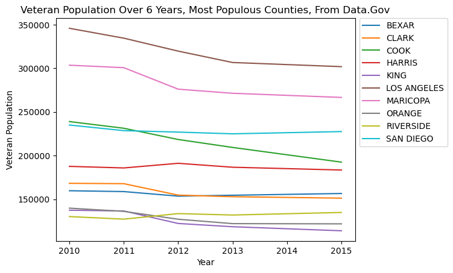\
San Diego is #3 in veteran population. However, we noticed something strange about this.

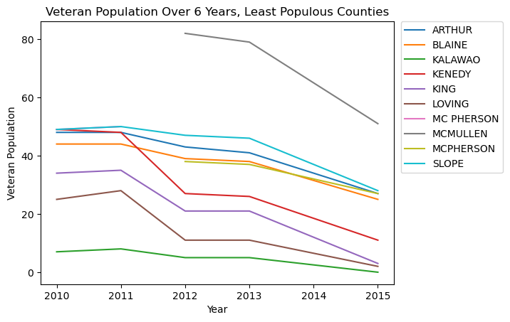\
\
The top 10 are not alone: veteran population is dropping across the board. There are a few places where it increases slightly, but, overall, it’s fairly rapidly decreasing.
In the wake of the wars in the Middle East, one would think that we’d get even more veterans. However, this doesn’t seem to be the case. Why is that? Unfortunately, our data did not hold the answers.

### The VA uses census population estimate data to prepare the budget for each year; how accurate are these estimates?
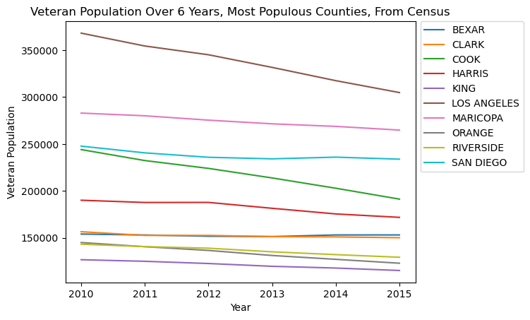\
This graph looks very similar to the one for the top 10 cities from earlier, with some minor differences: the curves are more gradual, and San Diego is slightly higher, but overall it looks very similar. However, that’s just the graphed lines. Do the numbers compare?

\
For the most part, they do. However, the estimates are high, and the margins of error given by the census (which, unfortunately, were not obtainable for the data set) do not account for the difference between the estimates and measured numbers. So budget allocations are based on inflated data. The good news is that, over time, the estimates do get better.

### How much did the Department of Veterans Affairs spend each year from 2010 - 2015?
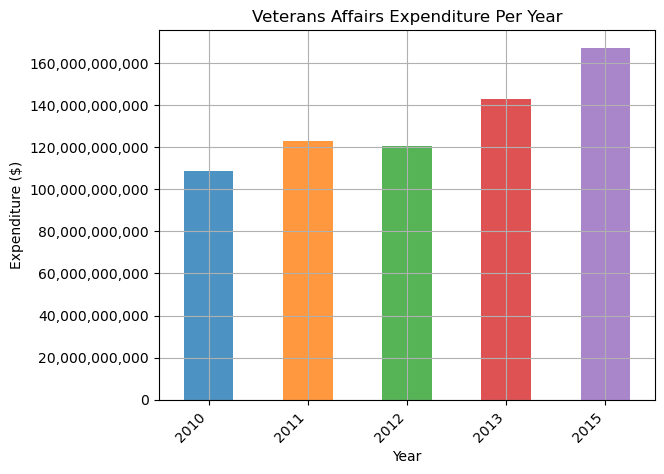\
Between 2010 - 2015 Veterans Affairs expenditure rose by approximately 60 Billion dollars. There was a relatively steady increase in expenditure across the years except for 2012 which saw a slight decrease in expenses. This 2012 decrease is also reflective in San Diego’s yearly expenditure, as well as the average expenditure trend across all counties.

\
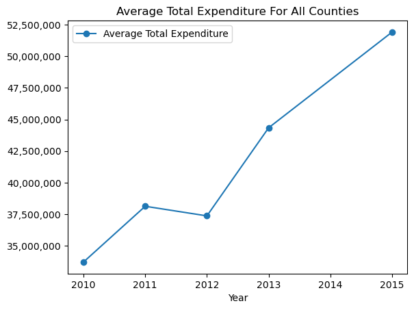

### Which counties had the highest expenditure?
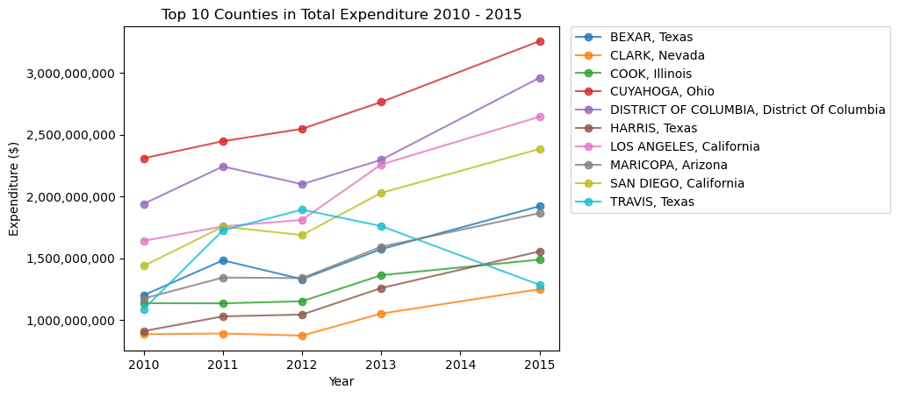

Based on our population top ten results we decided to also explore the top ten counties for highest expenditure to see the number of counties on both lists.  Seven out of the top ten counties are on both lists:

* Bexar - Texas
* Clark - Nevada
* Cook - Illinois
* Harris - Texas
* Los Angeles - California
* Maricopa - Arizona
* San Diego - California

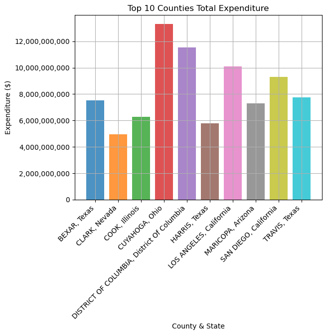\
Surprisingly the county with the highest expenditure, Cuyahoga - Ohio, does not feature within the veteran population top ten counties. 

San Diego County had the 4th highest expenditure in the country, spending approximately 9.3 Billion from 2010 - 2015.

While this indicates there is a good correlation between veteran population and total expenditure, it seems veteran population isn’t the only factor the VA takes into account when allocating funding.

\
This expenditure per capita from San Diego is mostly repeated across the nation. In an ideal world, this graph would have a very gentle upwards slope, as the average amount paid out to a veteran would only be increasing based upon inflation. Instead, it almost doubles over just a 6-year period. Why? Is the VA not getting enough money to give everyone what they need? Are industries taking advantage of the extra money and hiking rates for the same rendered services? Our data sets, unfortunately, don’t contain the answers.

### Which program is the most expensive?
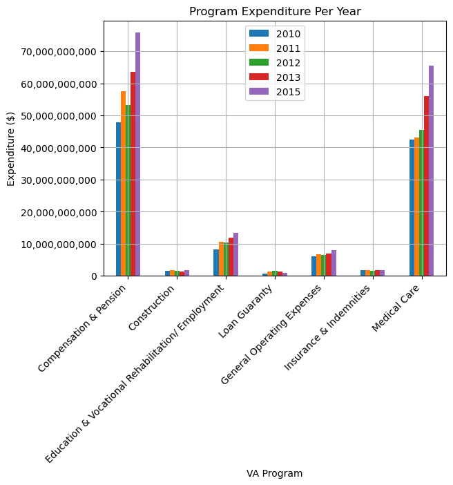\
This graph indicates that Compensation and Pensions was the most expensive program run by the VA from 2010-2015. Compensation refers to the disability payments that a veteran gets monthly for injuries or disabilities sustained whilst in the service. We believe It is appropriate that medical costs are a close second most expensive as ongoing healthcare costs would also result from these injuries.

###  Does the number of veterans receiving compensation and pensions match expenditure trends?
\
\
Surprisingly there is almost a steady increase of the number of veterans receiving compensation from 2010 - 2015. The increase in Compensation expenses also shares strong similarities to the increase of veterans receiving compensation.

### Compensation - Which counties have the most compensation and how does that compare to San Diego county?

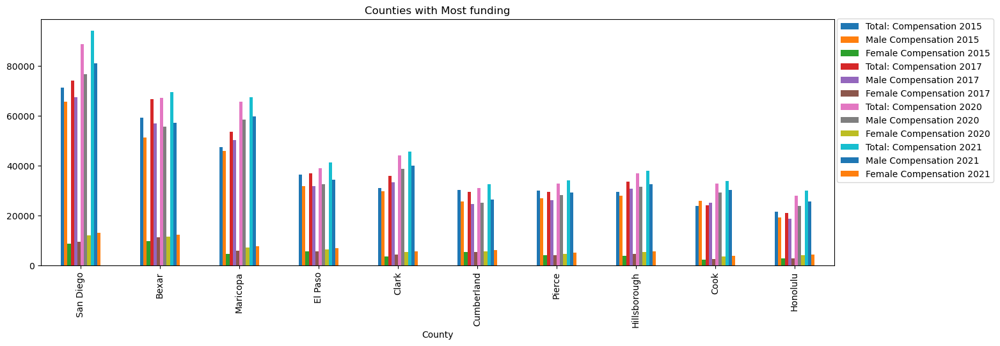\
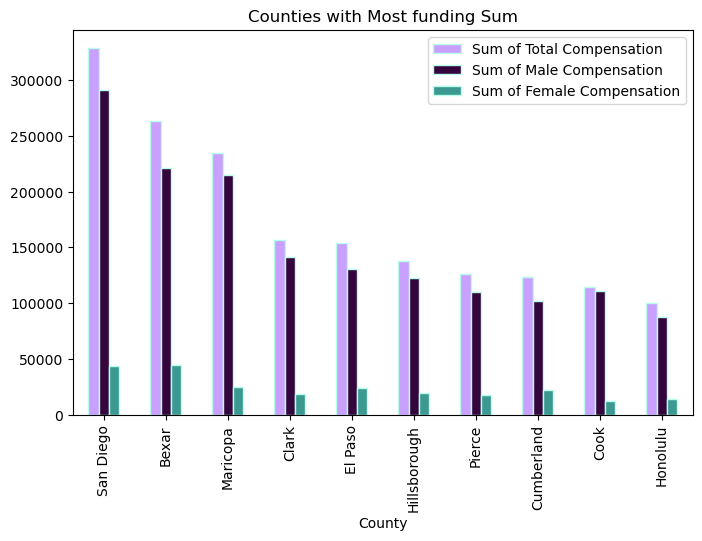\
San Diego had the most compensation overall in Male Compensation and Total Compensation. Bexar county took the lead in Female compensation. The female compensation is significantly less.  The compensation for San Diego significantly increased throughout the years.

\
Many of the same values for San Diego Matched the max values for Female, Male, and Total Compensation.

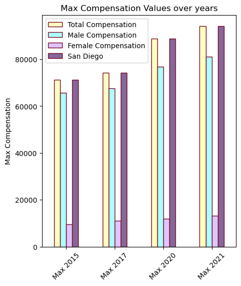\
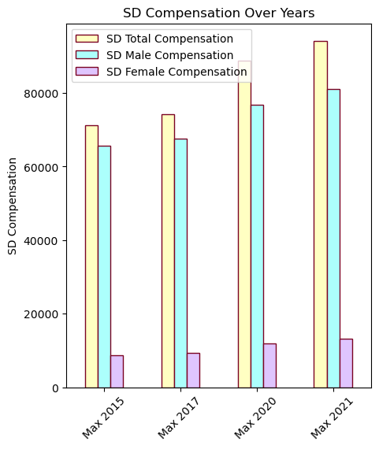\
Here is the sum of the total compensation over the four years: 

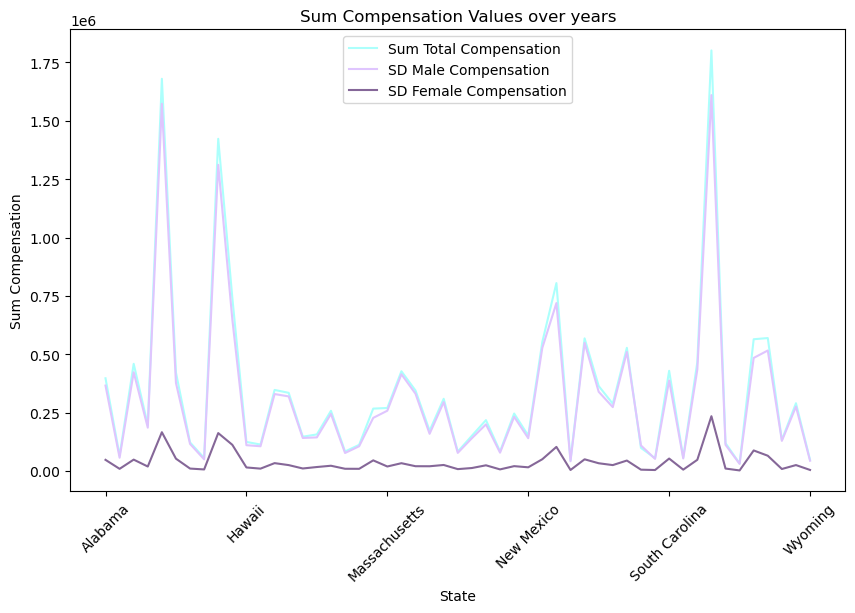\
At least one county from each state was greater than the mean in 2015 with California, Florida, and Texas having 36.

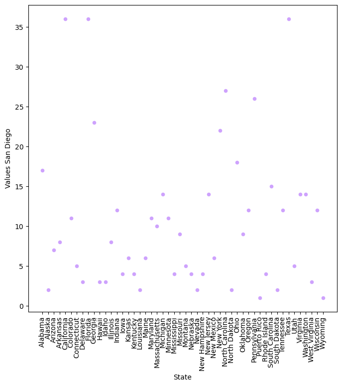\
When adding the total compensation of the years together then taking the mean, only three counties were greater than the mean in Arizona, California, and texas.

## Sources:

All Department of Veterans Affairs data has been sourced from data.gov. Veteran population numbers within the datasets are from the VA's own VetPop estimation model. Population estimates were also sourced from the Census API, for comparison to VA measured data.

`county_fips_master.csv` sourced from Kieran Healy at https://github.com/kjhealy/fips-codes (has been edited to include Puerto Rico)
